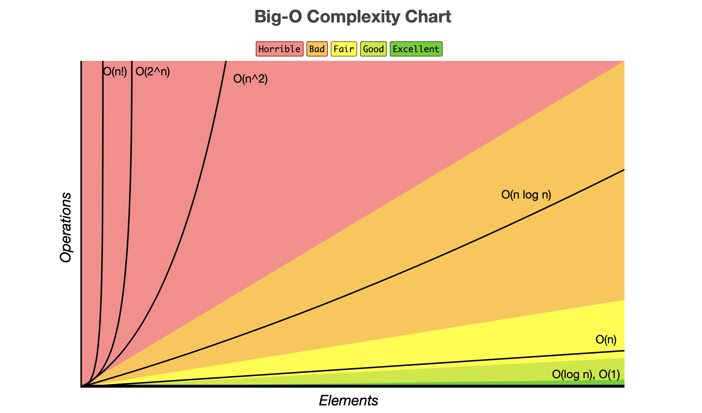
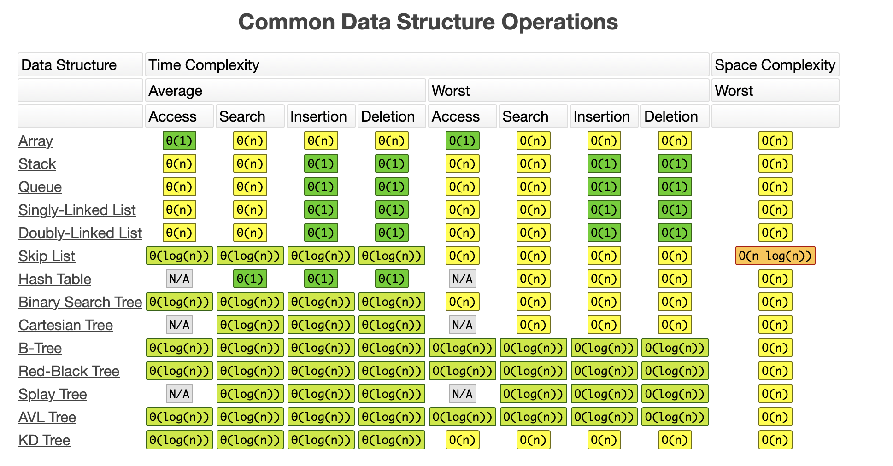
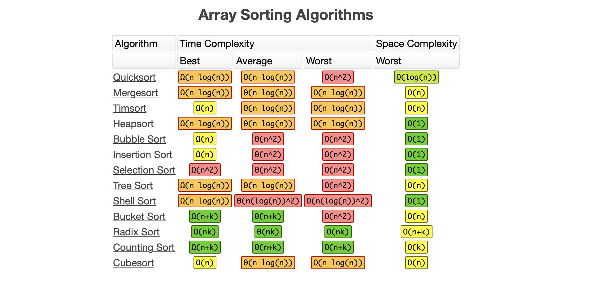

# Data Structures and Algorithms

## Data Structures Implementation

1. Array
2. Hash Table
3. Linked List
4. Stack and Queue
5. Binary Search Tree
6. Graph

## Algorithms

1. Recursion
2. Sorting
3. Searching / Traversal
4. Dynamic Programming

## References

1. Udemy Course - Master the Coding Interview: Data Structures + Algorithms
2. [Geeks for Geeks](https://www.geeksforgeeks.org/learn-data-structures-and-algorithms-dsa-tutorial/)
3. [Big O Cheetsheet](https://www.bigocheatsheet.com)